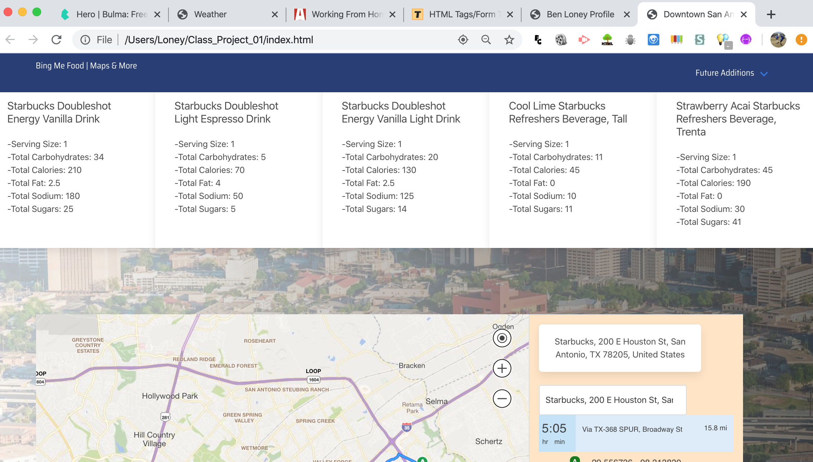

# Class_Project_01

## Purpose
The pupose of this app is to help students locate classroomsin and give them directions in real time walking distance.

## User Story
As A UTSA student at the downtown campus

I WANT to find a place to dine downtown.  

I need walking directions to the resturant.

I need nutritional information on food served at location.

